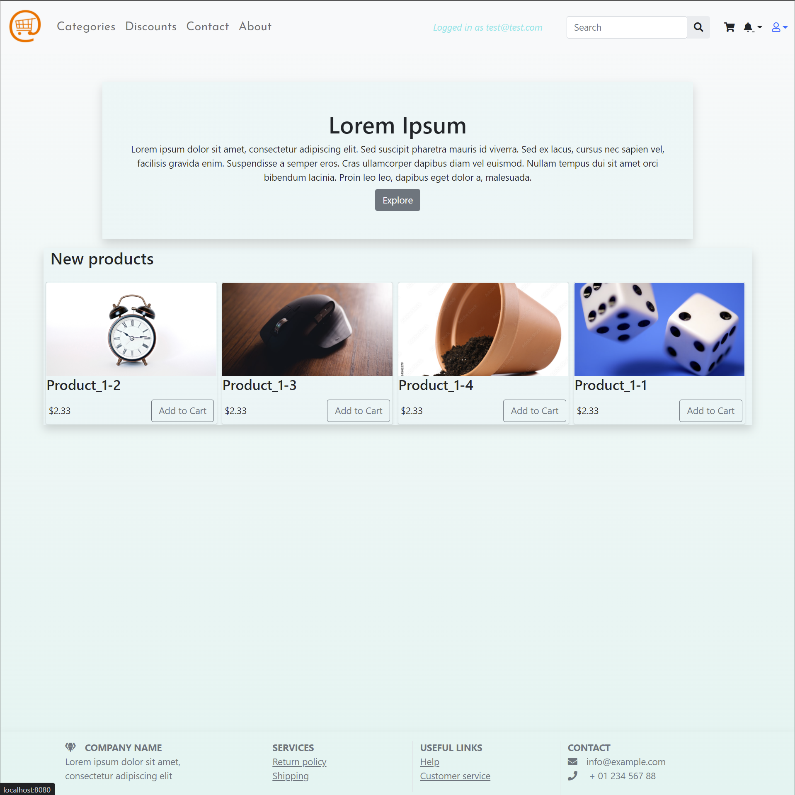
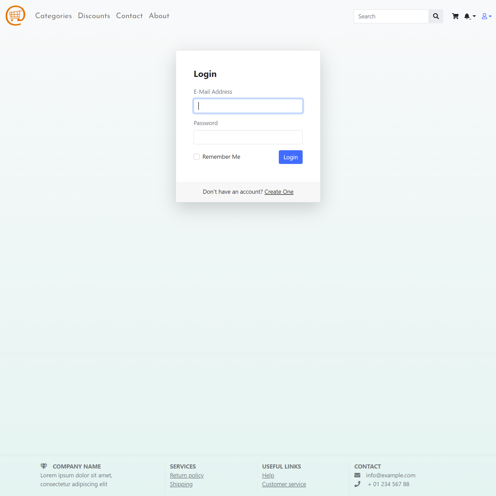
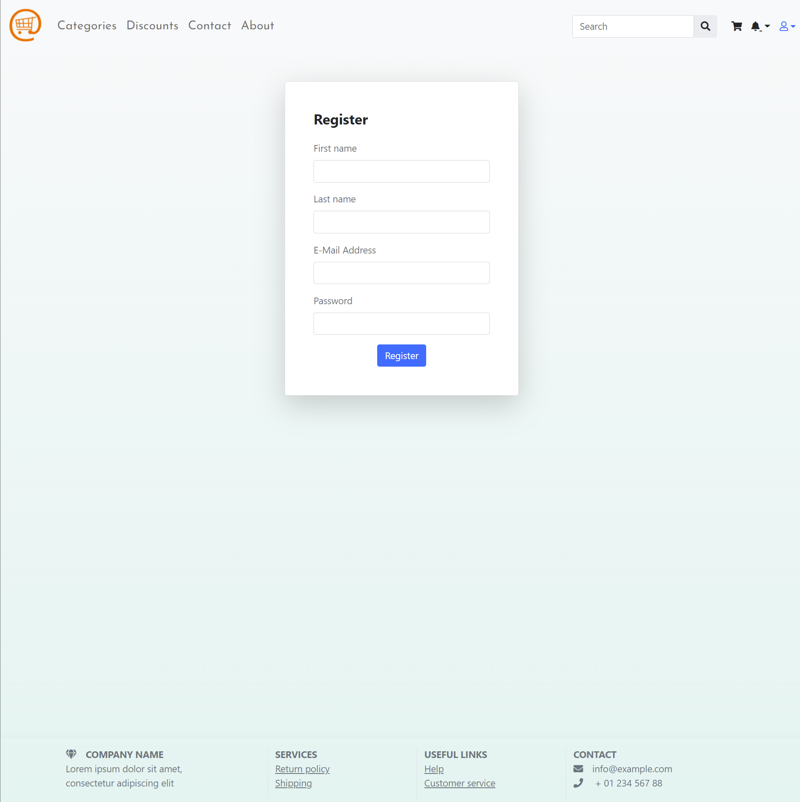
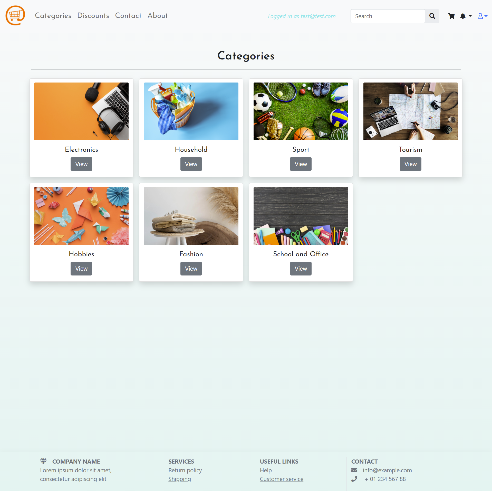
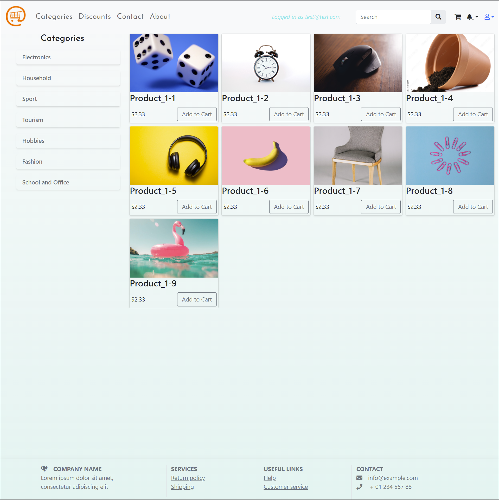
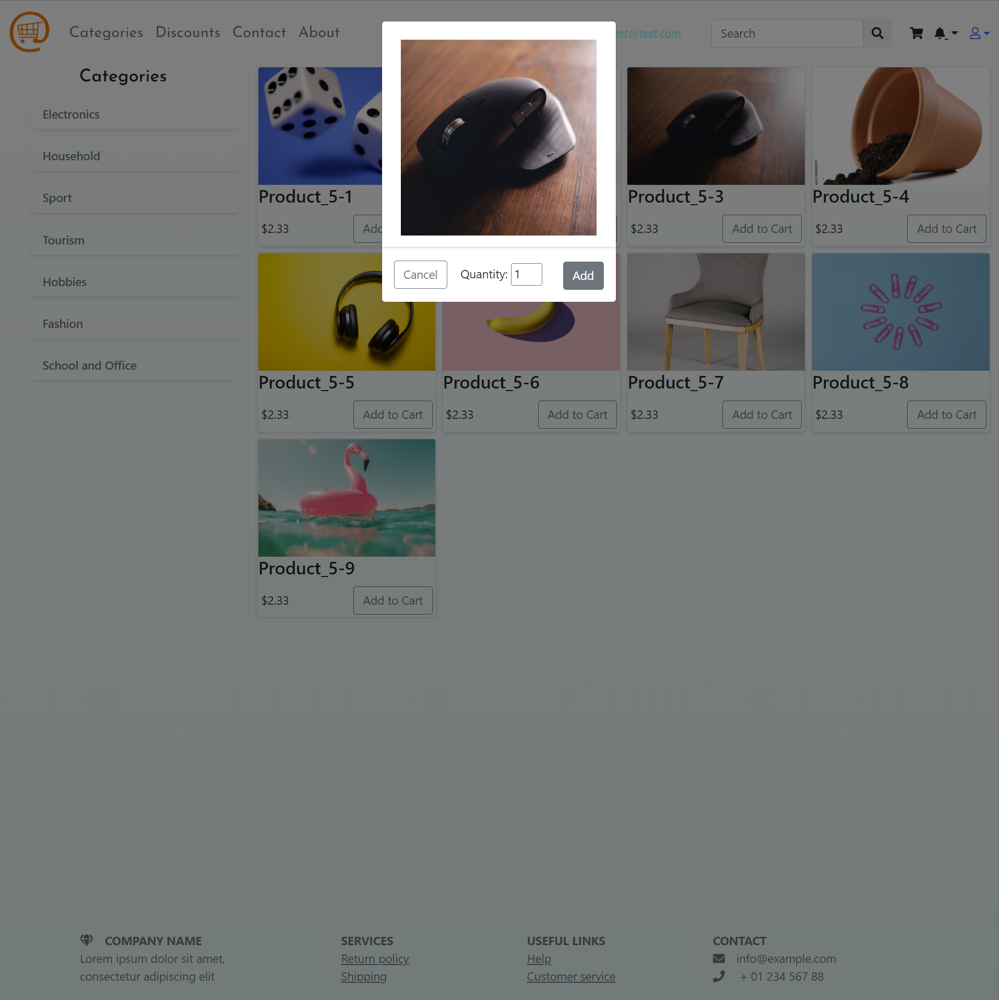
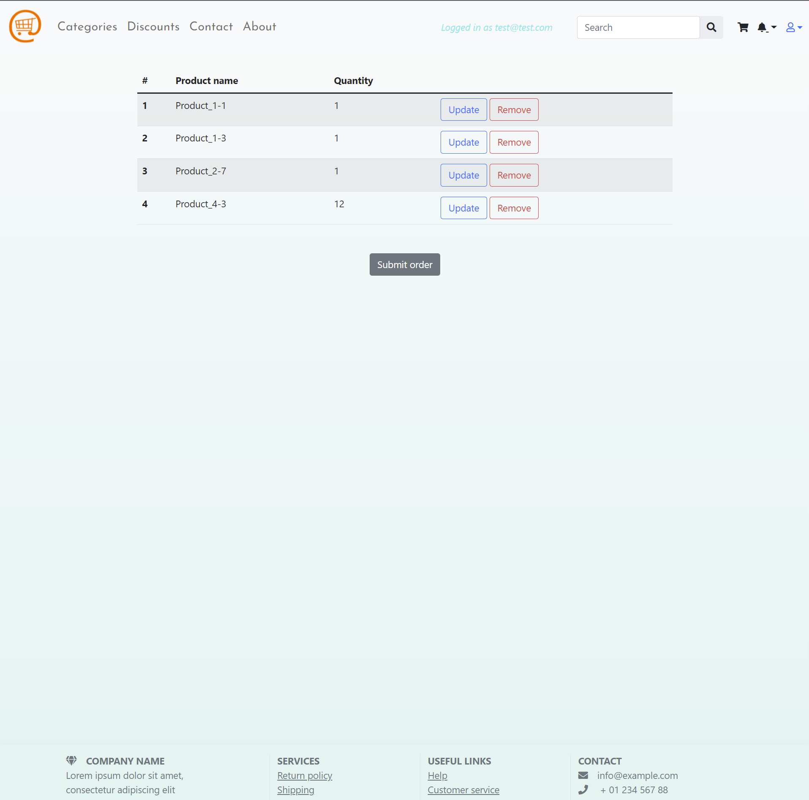

## OnlineStore

Web application made using:

- Spring Boot (MVC, JPA)
- Spring Security 
- Freemarker Template (Frontend)

Installation:
- Clone the repository
- Install all Maven dependencies
- Make sure you have PostgresSQL installed
- Copy the contents of `application.properties.example` to a new file with the following name: `application.properties`
- Update `spring.datasource.username` and `spring.datasource.password` values with the credentials from Postgres
- Create an empty database with the following name: `online_store`
- Run the application 
- Open http://localhost:8080 in the browser

Database schema will be generated automatically. 

There is some predefined seed data for the database that will be inserted to into the database automatically.

Screenshots:

